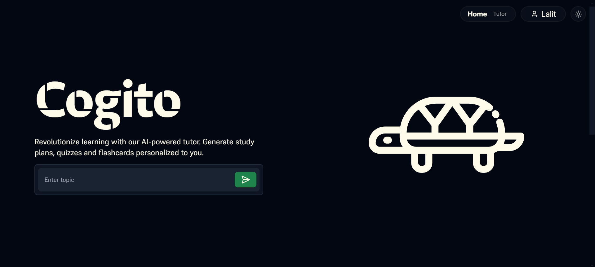
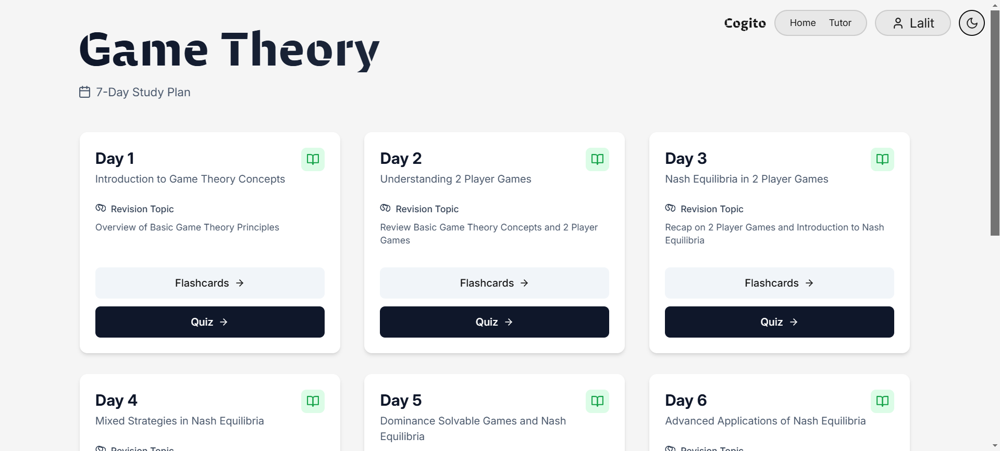

# cogito
Revolutionize learning with cogito.

Cogito is an AI-powered tutor that generates a personalized study plan for you. Simply give it a short prompt and generate a week long study plan tailored to your strenghts and weaknesses.

# Live Deployment
A live deployment can be found at [Cogito](https://cogito-tutor.vercel.app)

> Dark Mode

> Light Mode

 
# Demo
[Video](https://drive.google.com/file/d/1TEPuSTvjK2ft4t6UVzbADbXd9PRmvF9c/view?usp=sharing)

# Setup
## Backend
   1. Populate `.env` file as shown in `.env.example`
   2. Install requirements using `pip install -r requirements.txt`
   3. Run `uvicorn main:app`

## Frontend
   1. Populate `.env` file as shown in `.env.example`
   2. Run `npm install`
   3. Run `npm run -- --open`
   4. Enjoy!
 
# Team Members
   - [Rachit](https://github.com/rachitkumar205)
   - [Jia](https://github.com/icingtea)
   - [Lalit](https://github.com/lalitm1004)